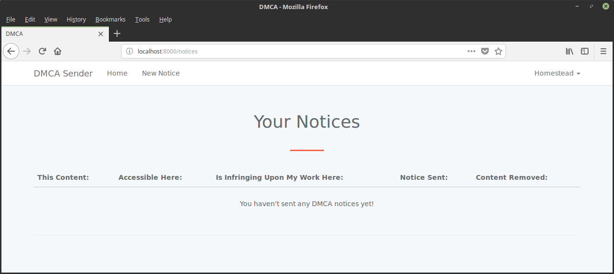
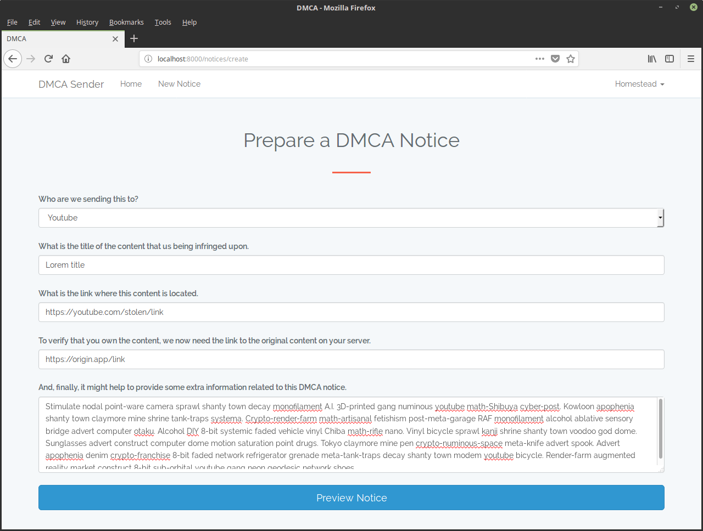
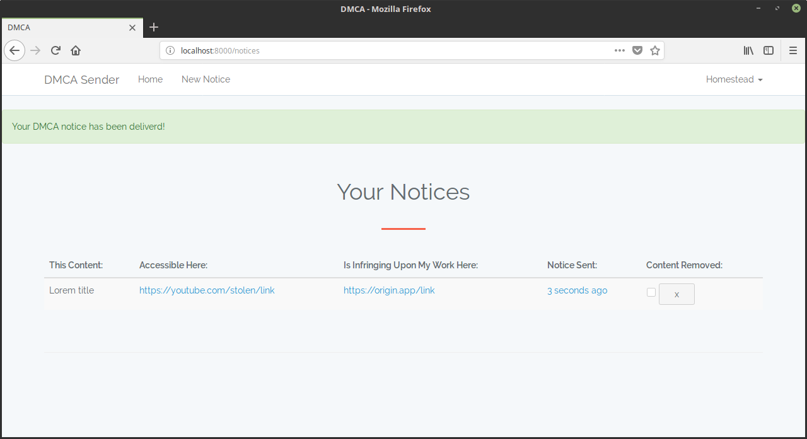
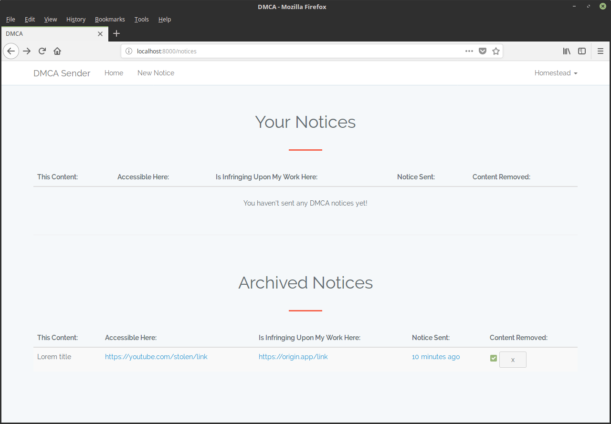

# DMCA App


[](LICENSE)

### *Under Development*

It's a Laravel WebSite that allows users to create *`Digital Millennium Copyright Act`* requests to prevent copyright infringement


#### Configuration
	

###### Config the ***.env*** file and then Run
```
php artisan key:generate
php artisan migrate --seed
php artisan serv
```

## The Route List

| Method    | URI                    | Middleware   |
| :-------- | :--------------------- | :----------- |
| GET\|HEAD | /                      | web          |
| GET\|HEAD | home                   | web,auth     |
| GET|HEAD  | login                  | web,guest    |
| POST      | login                  | web,guest    |
| POST      | logout                 | web          |
| POST      | notices                | web,auth     |
| GET\|HEAD | notices                | web,auth     |
| POST      | notices/confirm        | web,auth     |
| GET\|HEAD | notices/create         | web,auth     |
| PUT\|PATCH| notices/{notice}       | web,auth     |
| POST      | password/email         | web,guest    |
| GET\|HEAD | password/reset         | web,guest    |
| POST      | password/reset         | web,guest    |
| GET\|HEAD | password/reset/{token} | web,guest    |
| GET\|HEAD | register               | web,guest    |
| POST      | register               | web,guest    |


## The content of the project:










